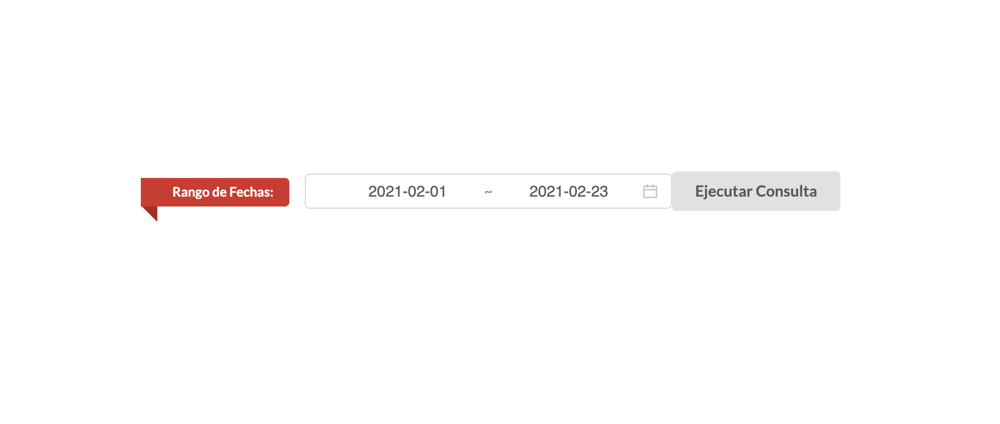
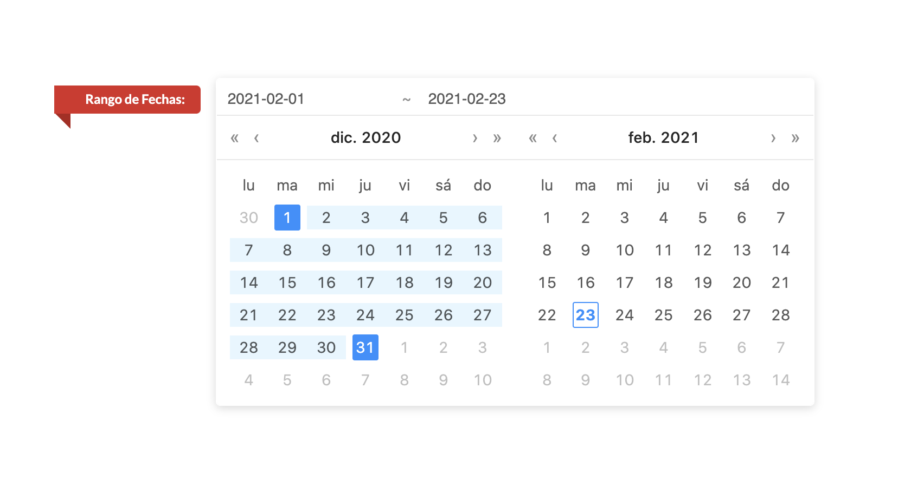
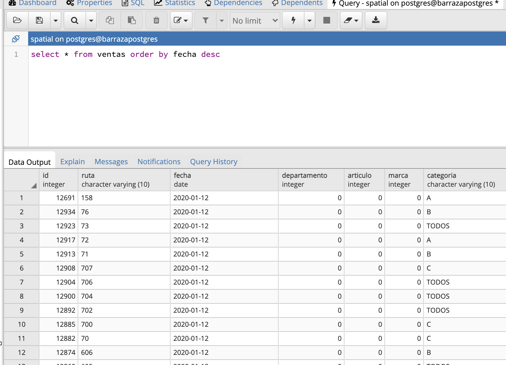
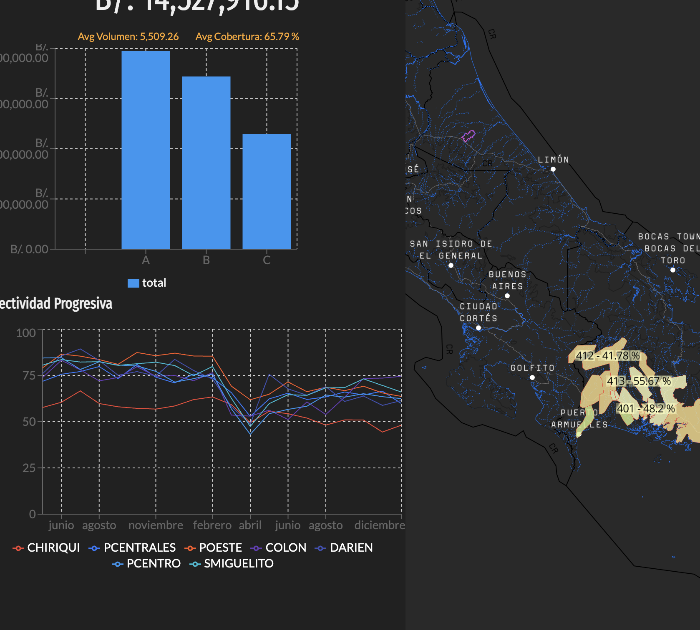

#Introducción
Una de las pantallas de MapSales ha sido diseñada con el propósito de mostrar el comportamiento global de ventas a lo largo de los meses pasados. Esta pantalla introduce una nueva variable estadística denominada "efectividad". Sin embargo, hasta el momento no es posible actualizar el mapa automáticamente con cada mes que pasa.

##¿Dónde se almacena los datos históricos?
En el servidor 243 he creado una instancia de bases de datos con PostgreSQL. En esta instancia existe una bases de datos denominada "spatial". En ella tenemos una tabla denominada "ventas". Esta tabla lleva un registro de ventas acumuladas por ruta en cada mes. Estos registros deben actualizarce mediante un script que selecciona los datos provenientes de SAP, los procesa y los inserta en la tabla **spatial.ventas**. **MapsSales** necesita esta tabla para alimentar la pantalla **Histórico por Regiones**.

##¿Cómo Actualizar la tabla spatial.ventas

El procedimiento para actualizar la tabla **spatial.ventas** es bastante sencillo. En MapSales existe una ruta oculta al usuario regular que se puede ver cuando visitamos en el navegador la ruta:

    http://192.170.1.243:8080/historicosAdmin

En esta patalla, lo único que verás son los siguientes controles:

Supongamos que queremos actualizar la tabla para agregar el mes de diciembre de 2020. Entonces seleccionamos según la imagen:

Luego, clic en el botón **Ejecutar Consulta**. Veremos una animación de espera. Una vez terminado el procedimiento podemos comprobar que la tabla **spatial.ventas** fue actualizada con nuevos registros para el mes de ejemplo mediante una consulta SQL:

Luego, en el navegador, si vamos a la dirección 

    http://192.170.1.243:8080/historicoAnalisisRegion

Observaremos que la gráfica ha avanzado a diciembre:

Y ese sería el fin del procedimiento.

