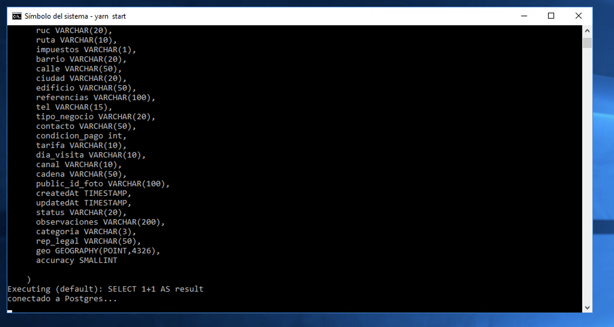

Encontramos dos situaciones:

##El servidor 192.170.1.243 ha sido reiniciado por cualquier circunstancia.

En la línea de comandos del servidor ingresamos a la ruta C:\apps\mapsales_test:

    C:\apps\mapsales_test\

y ejecutamos el siguiente comando:

    C:\apps\mapsales_test\set NODE_ENV = production

Este comando establece la variable de entorno NODE_ENV en el valor de "production", necesaria para que la aplicación se ejecute en modo producción en el servidor; de lo contrario, mostrará errores de ejecución.

Luego del paso anterior, ejecutamos:

    C:\apps\mapsales_test\yarn start

Se ejecuta un script de inicialización. Veremos la ejecución de un test de conexión a las bases de datos:

Una vez vemos este resultado en la consola de comandos podemos abrir un navegador y verificar que en la ruta:
    http://192.170.1.243:8080

Tengamos el siguiente resultado:

##El servidor no se ha reiniciado ni apagado, pero el servicio de MapSales esta detenido:

En ese caso sólo debemos ejecutar:

    C:\apps\mapsales_test\yarn start

